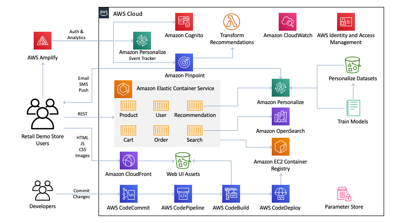

# Retail Demo Store

A sample retail web application and workshop platform intended as an educational tool for demonstrating how AWS infrastructure and services can be used to build compelling customer experiences for eCommerce, retail, and digital marketing use-cases.

**This project is intended for educational purposes only and not for production use.**

The Retail Demo Store is an eCommerce reference implementation designed to showcase how AWS services can be used to build compelling shopping experiences using modern architecture and design patterns.

At the heart of the Retail Demo Store is a collection of polyglot microservices hosted in [Amazon Elastic Container Service](https://aws.amazon.com/ecs/) ([AWS Fargate](https://aws.amazon.com/fargate/)) that represent domain constructs such as [products](src/products), [carts](src/carts), [orders](src/orders), and [users](src/users) as well as services for [search](src/search) and [recommendations](src/recommendations). While the [web user interface](src/web-ui) is served by Amazon CloudFront and Amazon S3.

The architecture is supported by several managed services including [Amazon Cognito](https://aws.amazon.com/cognito/), [Amazon Pinpoint](https://aws.amazon.com/pinpoint/), [Amazon Personalize](https://aws.amazon.com/personalize/), and [Amazon OpenSearch Service](https://aws.amazon.com/opensearch-service/) (successor to Amazon Elasticsearch Service). The [web user interface](../src/web-ui]) is built using the [Vue.js](https://vuejs.org/) framework with [AWS Amplify](https://aws.amazon.com/amplify/) to provide integrations with Cognito for registration/authentication and event streaming to Pinpoint and Personalize (Event Tracker). Finally, [AWS CodePipeline](https://aws.amazon.com/codepipeline/) is leveraged to demonstrate how AWS development services can be used to orchestrate the build and deployment process with the Retail Demo Store.

## Hands-On Workshops

This project is designed to provide you with an environment in which you can learn to use AWS services to modify the behavior of an ecommerce application, based on business requirements. This can be done in a group setting or as an individual using self-paced workbooks. Currently there are workshops for adding search, personalization, experimentation frameworks, a/b testing, analytics, customer data platforms (CDPs), messaging, and more.

In order to use the workshops, you will need to deploy the Retail Demo Store into an AWS account, using one of the methods described in the Getting Started or Developers sections below.  This is necessary because the workshops run in SageMaker Jupyter notebooks, which provide an interactive Python environment where you can execute code in the Retail Demo Store environment.

AWS Service | Workshops Overview | Workshop Links | Level | Duration
--- | --- | --- | --- | ---
 Amazon Personalize | The Retail Demo Store uses Amazon Personalize to provide similar item recommendations, search re-ranking based on user preferences, and product recommendations based on user item interactions.  The attached workshop is a throrough walk through of the major features of Amazon Personalize, and how it can be deployed in an ecommerce application like the Retail Demo Store. | [Personalize Setup](./workshop/1-Personalization/Lab-1-Introduction-and-data-preparation.ipynb) | 300 | 2-2.5 hours

## Supported Regions

The Retail Demo Store has been tested in the AWS regions indicated in the deployment instructions below. Additional regions may be supported depending on [service availability](https://aws.amazon.com/about-aws/global-infrastructure/regional-product-services/) and having the Retail Demo Store's deployment resources staged to an S3 bucket in the targeted region.

# Getting Started

***IMPORTANT NOTE:** Deploying this demo application in your AWS account will create and consume AWS resources, which will cost money. In addition, some features such as account registration via Amazon Cognito and the messaging workshop for Amazon Pinpoint require users to provide a valid email address and optionally a phone number to demonstrate completely. Therefore, to avoid ongoing charges and to clean up all data, be sure to follow all workshop clean up instructions and shutdown/remove all resources by deleting the CloudFormation stack once you are finished.*

**The Retail Demo Store experience is for demonstration purposes only. You must comply with all applicable laws and regulations, including any laws and regulations related to email or text marketing, in any applicable country or region.**

**If you are a developer looking to contribute to the Retail Demo Store, please see the Developer section below.**

To get the Retail Demo Store running in your own AWS account, follow these instructions. If you are attending an AWS-led event where temporary AWS accounts are provided, this has likely already been done for you. Check with your event administrators.

## Step 1 - Get an AWS Account

If you do not have an AWS account, please see [How do I create and activate a new Amazon Web Services account?](https://aws.amazon.com/premiumsupport/knowledge-center/create-and-activate-aws-account/)

## Step 2 - Log into the AWS Console

Log into the [AWS console](https://console.aws.amazon.com/) if you are not already.

Note: If you are logged in as an IAM user, ensure your account has permissions to create and manage the necessary resources and components for this application.

## Step 3 - Deploy to your AWS Account

The following CloudFormation launch options will set the deployment approach to "CodeCommit". You can ignore the GitHub related template parameters. After clicking one of the Launch Stack buttons below, follow the procedures to launch the template. **Be sure to enter a CloudFront stack name in lowercase letters (numbers and hyphens are okay too).**

With this deployment option, the CloudFormation template will import the Retail Demo Store source code into a CodeCommit repository in your account and setup CodePipeline to build and deploy into ECS from that respository.

Region name | Region code | Launch
--- | --- | ---
US East (N. Virginia) | us-east-1 | 
US West (Oregon) | us-west-2 | 
Europe (Ireland) | eu-west-1 | 
Asia Pacific (Tokyo) | ap-northeast-1 | 
Asia Pacific (Sydney) | ap-southeast-2 | 

The CloudFormation deployment will take approximately 40 minutes to complete.

### Notes:

#### Amazon Personalize Campaigns

If you chose to have the Amazon Personalize campaigns automatically built post-deployment, this process will take an additional 2-2.5 hours. This process happens in the background so you don't have to wait for it to complete before exploring the Retail Demo Store application and architecture. Once the Personalize campaigns are created, they will be automatically activated in the [Web UI](src/web-ui) and [Recommendations](src/recommendations) service. You can monitor the progress in CloudWatch under the `/aws/lambda/RetailDemoStorePersonalizePreCreateCampaigns` log group.

## Step 4 - Using the Retail Demo Store Web Application

Once you launch the CloudFormation stack, all of the services will go through a build and deployment cycle and deploy the Retail Demo Store.

Compiling and deploying the web UI application and the services it uses can take some time. You can monitor progress in CodePipeline. Until this completes, you may see a Sample Application when accessing the public WebUI URL.

You can find the URL for the Retail Demo Store Web UI in the Outputs of your main CloudFormation stack (called `retaildemostore` unless you changed that option in the steps above).

Look for the "WebURL" output parameter.

**IMPORTANT NOTE: You must load the WebURL over HTTP and _not_ HTTPS.** The reason for this is that the microservice load balancers do not have SSL certificates configured by default and are therefore accessed by the web application over HTTP. Although the web application is served from CloudFront and CloudFront provides a default SSL certificate for the distribution, you will receive mixed content errors in the browser if you attempt to load and run the web application over HTTPS.

You can read more [detailed instructions on how to demo the Retail Demo Store in the Demo section at the end of this document](#delivering-a-demo-of-the-retail-demo-store).

# License

This sample code is made available under a modified MIT license. See the LICENSE file.
